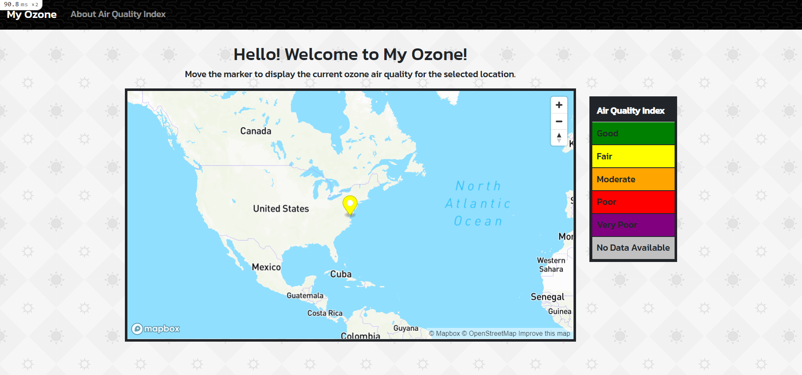

# My Ozone

Application that connects to the OpenWeatherMap and MapBox api's and displays Air Quality Index data on an interactive map. Users can select and drag a marker to different locations on the map to see the air quality rating for each location.

## Getting Started

These instructions will get you a copy of the project up and running on your local machine for development and testing purposes.

1. First clone the git repository, copy the url, and run 'git clone paste-url-here' in your coding environment. 

2. From here, you will need to run 'bundle install' to install the necessary gems. 

3. In order to deploy your own copy of this project, you will need to create an api key for OpenWeatherMap and an access token for MapBox. Otherwise the map feature will not work.

4. Once you have created the necessary keys, you should be able to get the project up and running on your local machine.

## Deployed Version of the App:

https://myozone-will-daskam.herokuapp.com/

## Built With

* [Bootstrap](https://getbootstrap.com/) - The web framework used

* Ruby version: 2.7.4

## Author

* **Will Daskam**
